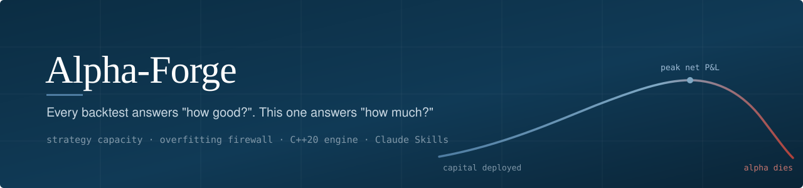
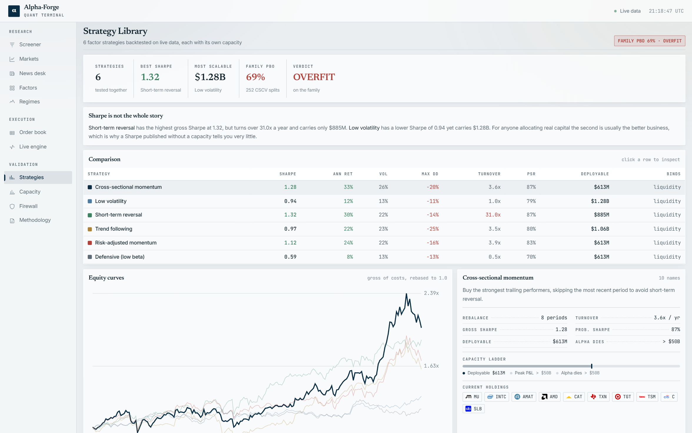
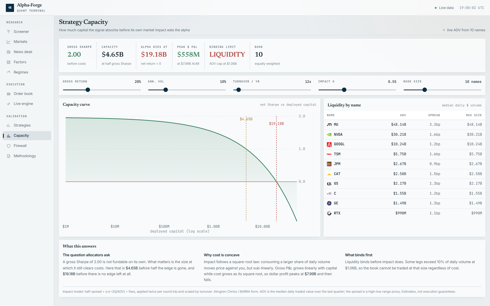
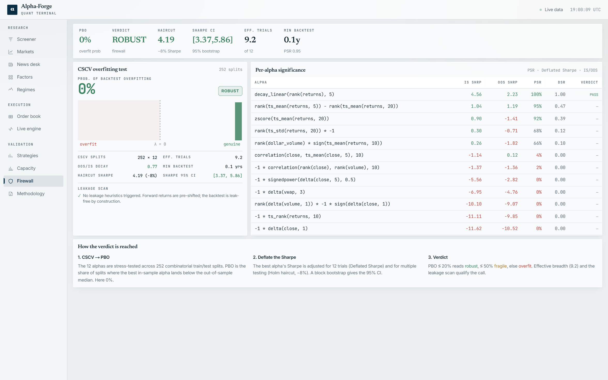
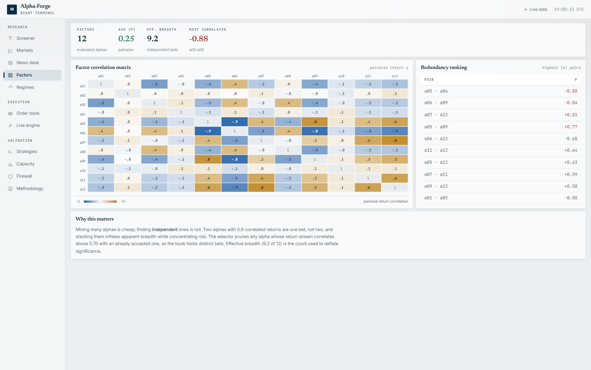
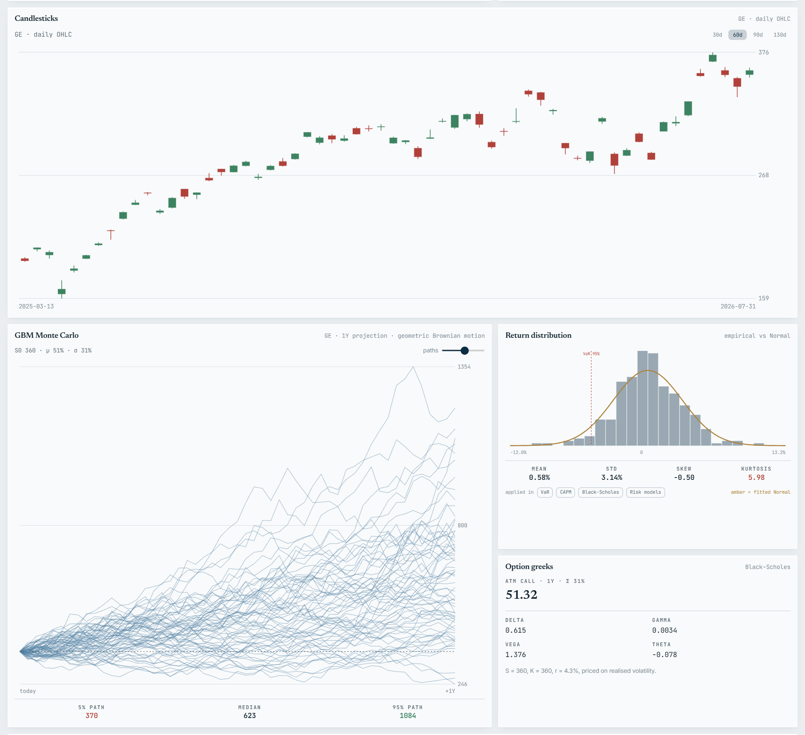
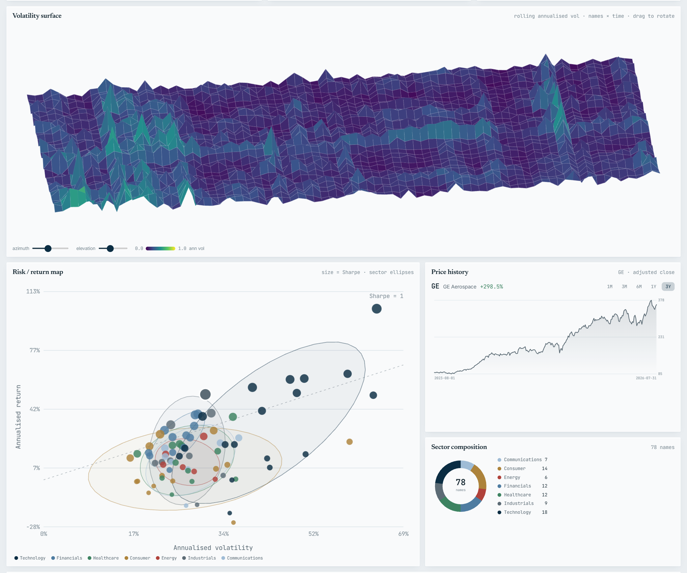
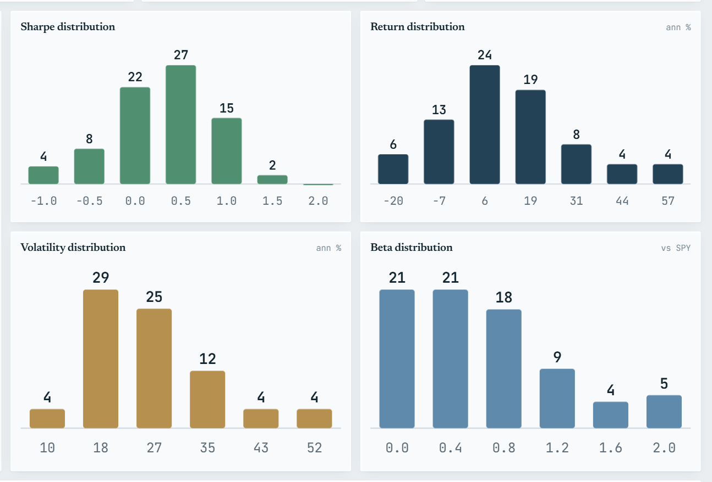
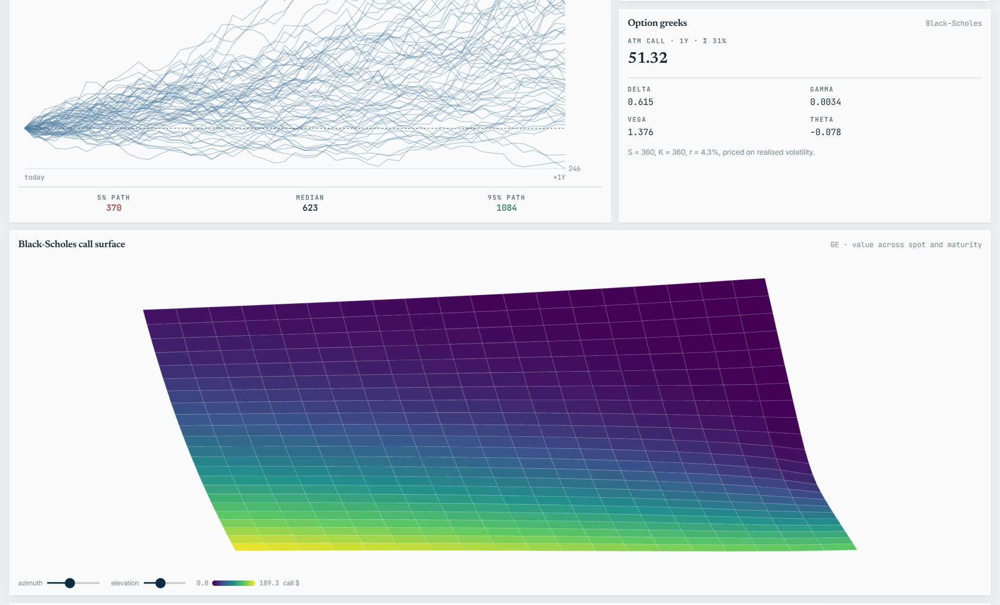
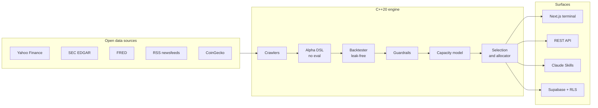

<div align="center">



<br>

**A quantitative research platform that answers the question every backtest skips:
not "how good is this strategy?" but "how much money can it actually run?"**

<br>

[](backend/)
[](frontend/)
[](frontend/)
[](frontend/)
[](supabase/)
[](deploy/)
[](.claude/skills/)

[](backend/tests/)
[](backend/CMakeLists.txt)
[](#data-provenance)
[](.claude/skills/)

[Product video](#product-video) · [Why it exists](#why-it-exists) · [Quick start](#quick-start) · [Claude Skills](#use-it-as-claude-skills) · [Architecture](#architecture)

</div>

---

## Product video

<div align="center">

<video src="https://github.com/AhmedRaoofuddin/Quant/raw/main/media/alpha-forge.mp4" controls width="100%"></video>

**[Watch: media/alpha-forge.mp4](media/alpha-forge.mp4)**  ·  narrated overview, 2 min 40 s

<sub>If the player does not load, GitHub is serving the file as a download. Click the link above.</sub>

</div>

---

## The terminal

Eleven pages on live prices. No API keys, no paid feed.

<div align="center">



<sub><b>Strategies</b>  ·  20 documented anomalies backtested together, each with its capacity, factor
alpha and regime split. Reversal leads on Sharpe and still carries the least capital.</sub>

</div>

<table>
<tr>
<td width="50%"></td>
<td width="50%"></td>
</tr>
<tr>
<td><sub><b>Capacity</b>  ·  the curve, the binding constraint, and liquidity by name.</sub></td>
<td><sub><b>Firewall</b>  ·  PBO, deflated Sharpe and the verdict on the family.</sub></td>
</tr>
<tr>
<td></td>
<td></td>
</tr>
<tr>
<td><sub><b>Screener</b>  ·  78 equities ranked on live analytics.</sub></td>
<td><sub><b>Factors</b>  ·  pairwise correlation and effective breadth.</sub></td>
</tr>
</table>

### The quant toolkit

Priced on real data, not toy series.

<div align="center">



<sub><b>Candlesticks</b> on real OHLC, a <b>geometric Brownian motion Monte Carlo</b> with 5th, median
and 95th percentile paths, the <b>return distribution</b> against a fitted Normal with the 95% VaR
marked, and <b>Black-Scholes greeks</b> priced off realised volatility.</sub>

<br><br>



<sub><b>Volatility surface</b>, rolling annualised vol across names and time, rotatable by azimuth and
elevation. <b>Risk / return map</b> with sector ellipses and the Sharpe = 1 line.</sub>

</div>

<table>
<tr>
<td width="50%"></td>
<td width="50%"></td>
</tr>
<tr>
<td><sub><b>Distributions</b>  ·  Sharpe, return, volatility and beta across the universe.</sub></td>
<td><sub><b>Black-Scholes</b>  ·  greeks and the call surface.</sub></td>
</tr>
</table>

---

## Why it exists

A Sharpe ratio quoted without a capacity is close to meaningless, and almost every backtest you
will ever read quotes one anyway.

Consider two strategies measured on the same live universe by this repo:

| Strategy | Gross Sharpe | Turnover | Deployable capital |
|---|---:|---:|---:|
| Short-term reversal | **1.32** | 31.0x / yr | $885M |
| Low volatility | 0.94 | 1.0x / yr | **$1.28B** |

Reversal wins on the number everyone publishes and loses on the number that decides whether a fund
can allocate. Its edge is real; it just cannot be bought at size, because cost scales with turnover
while alpha does not. **A backtest that cannot tell you this is not finished.**

Alpha-Forge answers the four questions an allocator actually asks, in order:

<table>
<tr>
<td width="33%" valign="top">

### 1. What does it do?

Cross-sectional strategies backtested walk-forward on real prices. Scores at time `t` see data up
to `t`; the return is earned `t` to `t+1`. Turnover is measured from actual holdings churn, not
assumed.

</td>
<td width="33%" valign="top">

### 2. Is it real?

The overfitting firewall: PBO via CSCV, Deflated Sharpe, Probabilistic Sharpe, Holm haircut, block
bootstrap. Run it on pure noise and it returns **97% PBO**, which is the correct answer.

</td>
<td width="33%" valign="top">

### 3. How much can it run?

The capacity engine. Square-root market impact (Almgren-Chriss / BARRA), a participation cap, and
the honest answer of which constraint binds first.

</td>
</tr>
<tr>
<td colspan="3" valign="top">

### 4. Is it alpha, and does it survive being run together?

Factor attribution separates alpha from repackaged beta with Newey-West standard errors. Then
**joint capacity**: run the library together and overlapping names compete for the same daily
volume, so the blend carries far less than the sum of its parts.

</td>
</tr>
</table>

### Capacity is not additive

The measurement nobody else makes. Twenty strategies, each sized on its own book:

| | |
|---|---:|
| Sum of individual deployable capacities | $13.19B |
| What the blended book actually carries | **$1.53B** |
| **Overlap tax** | **88%** |

The strategies hold 55 distinct names between them. A name two strategies both want carries both
positions against one day's volume. Sizing each sleeve independently and adding up is the standard
mistake, and it overstates deployable capital by an order of magnitude here.

### The gap this fills

As of August 2026, searching GitHub for backtesting infrastructure returns a saturated field.
Matching engines are solved (8 to 15 ns/op). PBO has Python and R implementations. Queue-position
modelling exists in `hftbacktest`. What is missing is a tested implementation of
**strategy capacity**, the constraint that decides whether research becomes a product.

```
cost_bps(Q) = half_spread + eta * sigma_daily * sqrt(Q / ADV) * 1e4 + fees
```

Gross P&L grows linearly with capital; cost grows as its square root. Net alpha is therefore
unimodal: it rises, peaks, then dies. The engine solves for where.

---

## Quick start

<details open>
<summary><b>Frontend terminal</b>  ·  real market data, no keys required</summary>

```bash
cd frontend && npm install && npm run dev
```

Open `http://localhost:3000`. Eleven routes: screener, markets, news desk, factors, regimes, order
book, live engine, strategies, capacity, firewall, methodology.

</details>

<details>
<summary><b>C++ engine</b>  ·  the reference implementation</summary>

```bash
cmake -S backend -B backend/build -G Ninja -DCMAKE_BUILD_TYPE=Release
cmake --build backend/build
./backend/build/tests/alphaforge_tests
./backend/build/alphaforge discover
```

Zero-dependency core. Optional integrations are off by default:
`-DALPHAFORGE_WITH_CURL=ON` (Claude proposer), `-DALPHAFORGE_WITH_POSTGRES=ON` (Supabase).

</details>

<details>
<summary><b>Full stack</b>  ·  Docker</summary>

```bash
docker compose -f deploy/docker-compose.yml up --build
```

</details>

---

## Use it as Claude Skills

The three engines are packaged as installable
[Claude Code](https://claude.com/claude-code) skills. They run standalone: plain Node, **zero
dependencies**, no server, no API keys.

```bash
cp -r .claude/skills/strategy-capacity  ~/.claude/skills/
cp -r .claude/skills/backtest-firewall  ~/.claude/skills/
cp -r .claude/skills/strategy-builder   ~/.claude/skills/
```

| Skill | Answers | Entry point |
|---|---|---|
| **[strategy-builder](.claude/skills/strategy-builder/SKILL.md)** | What does this trading idea actually do? | `scripts/backtest.mjs` |
| **[backtest-firewall](.claude/skills/backtest-firewall/SKILL.md)** | Is that result real, or the best of many tried? | `scripts/firewall.mjs` |
| **[strategy-capacity](.claude/skills/strategy-capacity/SKILL.md)** | How much money can it run before impact eats it? | `scripts/capacity.mjs` |

They chain. Every script has a `--demo` flag, so you can see the output before wiring up your data:

```bash
node .claude/skills/strategy-builder/scripts/backtest.mjs --demo --emit-returns returns.json
node .claude/skills/backtest-firewall/scripts/firewall.mjs --returns returns.json
```

<details>
<summary><b>Real output</b>  ·  the firewall run on a pure-noise family</summary>

```
Backtest firewall  (8 strategies, 750 obs, 252 CSCV splits)
========================================================================
VERDICT               OVERFIT
Probability of backtest overfitting   97%
Effective independent trials          7.8 of 8
OOS-vs-IS Sharpe slope                -0.74  (negative: winners reverse)
  95% bootstrap CI on its Sharpe      [-1.04, 1.32]  <- includes zero
Holm haircut on best Sharpe           0.13 -> 0.00  (100% removed)
------------------------------------------------------------------------
The best in-sample strategy lands below the OOS median more often than not.
Selection among these is worse than random. Do not deploy the winner.
```

A firewall that passes noise is worthless. This is the test that matters.

</details>

<details>
<summary><b>Safe by construction</b>  ·  model-authored strategies cannot execute code</summary>

Scoring rules are declarative expression trees over a whitelisted op set, validated before
execution. **Nothing is ever `eval`'d**, including a rule a language model wrote.

```json
{ "op": "div",
  "a": { "op": "ret", "lookback": 60, "skip": 1 },
  "b": { "op": "vol", "lookback": 60 } }
```

Unknown ops are a hard error, not a silent zero. Same contract the C++ DSL enforces in
`backend/src/dsl/`.

</details>

---

## Architecture

Clean/hexagonal. Dependencies point inward: the pipeline depends on interfaces, and the composition
root picks implementations from config. That is why identical code runs on synthetic data locally
and real data plus Postgres in production.



<table>
<tr><th align="left">Layer</th><th align="left">Contents</th></tr>
<tr><td><code>backend/</code></td><td>C++20 engine: 79 files, 6,600 lines, 51 test cases. Typed exception hierarchy, RAII, clean under <code>-Wall -Wextra -Wpedantic</code></td></tr>
<tr><td><code>frontend/</code></td><td>Next.js 14 terminal: 77 files, 6,650 lines. Light institutional theme, WCAG AA contrast verified</td></tr>
<tr><td><code>.claude/skills/</code></td><td>Three installable skills, zero dependencies</td></tr>
<tr><td><code>supabase/</code></td><td>Postgres schema with row-level security</td></tr>
<tr><td><code>docs/</code></td><td>Full SDLC documentation, six phases plus capacity lifecycle</td></tr>
<tr><td><code>deploy/</code></td><td>Dockerfiles, compose for dev/test/prod, CI</td></tr>
</table>

### What is implemented

| Domain | Implementation |
|---|---|
| **Capacity** | Almgren-Chriss square-root impact, participation cap, geometric bisection for thresholds spanning orders of magnitude |
| **Overfitting** | PBO via CSCV, Deflated and Probabilistic Sharpe, Holm-Bonferroni haircut, circular block bootstrap, effective-trials derating |
| **Regimes** | Gaussian HMM, Baum-Welch EM training, Viterbi decoding |
| **Microstructure** | Limit order book with price-time priority matching |
| **Sentiment** | Loughran-McDonald finance lexicon with negation handling |
| **Alphas** | Sandboxed formulaic DSL, parsed and validated, never evaluated as code |

---

## Data provenance

Every source is open and keyless. No paid terminal, no proprietary feed, no scraped licensed data.

| Source | Provides |
|---|---|
| Yahoo Finance chart API | Daily OHLCV for 78 equities and 36 cross-asset instruments |
| SEC EDGAR | Company filings |
| FRED | Macro series |
| RSS newsfeeds | Nine finance feeds for the news desk |
| CoinGecko, Frankfurter | Crypto and FX reference rates |
| Wikidata / Wikimedia Commons | Company logos (`P154`) |

Logo coverage is verified rather than assumed:

```bash
cd frontend && node scripts/audit-logos.mjs
# Logo audit: 78/78 tickers resolve to a real mark
```

---

## Built to a six-phase delivery lifecycle

Each phase is documented and implemented.

| Phase | Scope | Document |
|---|---|---|
| 1 | Discovery: research, requirements, ROI, design, sign-off | [`docs/01-discovery.md`](docs/01-discovery.md) |
| 2 | Development: data model, engine, agents, DevOps, frontend | [`docs/02-development.md`](docs/02-development.md) |
| 3 | Governance and guardrails: I/O checks, RBAC, audit | [`docs/03-governance.md`](docs/03-governance.md) |
| 4 | Testing: six test types plus bug-fix flow | [`docs/04-testing.md`](docs/04-testing.md) |
| 5 | UAT: six gated steps | [`docs/05-uat.md`](docs/05-uat.md) |
| 6 | Production: release, watch, respond, improve; eight-gate DoD | [`docs/06-production.md`](docs/06-production.md) |
| + | The capacity feature traced end to end through all six | [`docs/07-capacity-lifecycle.md`](docs/07-capacity-lifecycle.md) |

---

## Engineering standards

- **C++20**, no compiler extensions. The tree compiles clean under `-Wall -Wextra -Wpedantic`;
  a warning is a defect, not noise.
- **Errors are typed exceptions** carrying an `ErrorCategory`, mapped at the top level to exit
  codes and HTTP statuses. No bare `throw` of a string.
- **The leak-free invariant is sacred.** Today's signal only ever meets tomorrow's pre-shifted
  return. Reviews reject look-ahead on sight.
- **Determinism.** Offline runs are seeded and reproducible; there is a test that keeps it so.
- **Security.** No `eval` or `system` on model output. Secrets come from the environment. Row-level
  security in the database.
- **Honest numbers.** A figure that pins to the edge of a solver's search range is reported as a
  bound (`> $50B`), never printed as though it were a measurement.

---

## Limitations

Stated plainly.

- Capacity figures are **model estimates, not execution guarantees**. The impact coefficient `eta`
  is a single global constant here; real desks calibrate it per name and per regime.
- **Cross-impact between correlated names is not modelled**, so concentrated books read
  optimistically.
- **Survivorship bias lives in the price panel**, not the code. A universe of today's index members
  flatters every backtest run on it.
- Results are gross of costs unless liquidity data is supplied.
- This is a research sandbox. **Nothing here is investment advice.**

---

## License

MIT. See [LICENSE](LICENSE).

<div align="center">
<br>
<sub>Built by Ahmed Raoofuddin.</sub>
</div>
