# Architecture

Alpha-Forge is a **clean / hexagonal** system: dependencies point inward toward the domain, and
the pipeline depends only on interfaces. The composition root (`app/Factory.cpp`) is the single
place that chooses concrete implementations, so the same engine runs on synthetic data + files
locally and real data + Supabase in production.

## Layers (inward-pointing dependencies)

```
        ┌───────────────────────────────────────────────┐
        │  apps/cli  ·  HttpServer  (delivery)           │
        ├───────────────────────────────────────────────┤
        │  app/Pipeline  ·  app/Factory (use-cases)      │
        ├───────────────────────────────────────────────┤
        │  proposer · engine · selection · allocator ·   │
        │  guardrails            (domain services)       │
        ├───────────────────────────────────────────────┤
        │  domain::Types   (entities — the core)         │
        ├───────────────────────────────────────────────┤
        │  data (interfaces) · math · platform (infra)   │
        └───────────────────────────────────────────────┘
   concrete adapters: Synthetic/CSV/Vendor DataSource,
   File/Postgres Repository, libcurl LLM — all behind interfaces
```

## Discovery pipeline

```mermaid
flowchart LR
  A[Crawl / load prices] --> B[Feature builder<br/>wide panels + fwd returns]
  B --> C[In / out-of-sample split]
  C --> D[Propose alphas<br/>LLM or offline]
  D --> E[Input guardrail<br/>DSL validate]
  E --> F[Backtest<br/>in & out of sample]
  F --> G[Second-AI risk review]
  G --> H[Select<br/>significance + decorrelation]
  H --> I[Allocate<br/>risk parity / MV / equal]
  I --> J[OOS portfolio backtest]
  J --> K[Persist run + audit]
```



## Key decisions

- **A DSL, not code.** Alphas are algebraic expressions parsed and validated before evaluation.
  Auditable *and* safe — the engine never executes model-generated code.
- **Leak-free by construction.** The feature builder pre-shifts the forward-return target, so the
  backtester can only ever pair today's signal with tomorrow's return.
- **Deflated Sharpe everywhere.** Mining many alphas inflates the best backtest; the deflated
  Sharpe corrects for the number of trials so noise does not masquerade as edge.
- **Zero mandatory third-party libraries in the core.** Portable, reviewable, trivially
  containerised; libcurl and libpq are optional, behind build flags and interfaces.

See [`adr/0001-formulaic-dsl.md`](adr/0001-formulaic-dsl.md).
